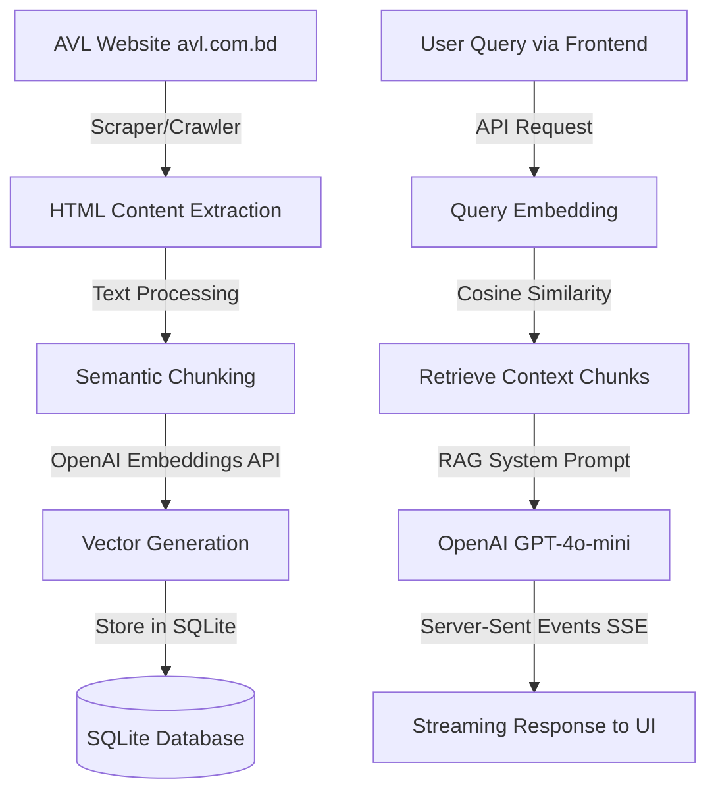

# AVL Group AI Chatbot & Web Scraper System

Welcome to the **Apparels Village Limited (AVL) AI Chatbot & Scraper System**. This repository contains a production-ready Django web application that crawls and scrapes the official AVL website ([avl.com.bd](https://avl.com.bd)), indexes its content, creates semantic chunks, generates vector embeddings using OpenAI's embeddings API, and provides a Retrieval-Augmented Generation (RAG) conversational interface with real-time response streaming.

---

## System Architecture Overview

The system is split into two primary workflows:



1. **Website Ingestion Pipeline**:
   - [scraper.py](file:///c:/Ai_engineering/avl-chat-bot/chatbot/scraper.py): A custom web scraper that recursively traverses pages belonging to `avl.com.bd`.
   - Cleans HTML, extracts meaningful body tags (headings, paragraphs, list items), chunks text to under 1200 characters, and calculates vector representations using OpenAI's `text-embedding-3-small` model.
   - Stores pages in [ScrapedPage](file:///c:/Ai_engineering/avl-chat-bot/chatbot/models.py#L3) and chunks in [PageChunk](file:///c:/Ai_engineering/avl-chat-bot/chatbot/models.py#L35).
   - Can be triggered as a management command or run as an asynchronous background thread.

2. **RAG Conversational Chat Engine**:
   - [views.py](file:///c:/Ai_engineering/avl-chat-bot/chatbot/views.py): Implements a Django Rest Framework (DRF) API endpoint `/api/chat/` using Server-Sent Events (SSE).
   - Generates user query vector, computes cosine similarity over database chunks, builds system instructions with injected context, and streams ChatGPT response word-by-word (`gpt-4o-mini`).
   - Persists chat history across sessions using [ChatSession](file:///c:/Ai_engineering/avl-chat-bot/chatbot/models.py#L12) and [ChatMessage](file:///c:/Ai_engineering/avl-chat-bot/chatbot/models.py#L19).

3. **User Interface**:
   - [index.html](file:///c:/Ai_engineering/avl-chat-bot/chatbot/templates/index.html): A sleek, premium, and fully responsive dark mode frontend UI built with HTML5, CSS3, and native JavaScript. Includes ambient glow animations, database scraper status indicators, quick suggestion pills, and a real-time word-by-word chat stream interface.

---

## File Registry & Directory Map

- [manage.py](file:///c:/Ai_engineering/avl-chat-bot/manage.py): Django administrative entrypoint.
- [requirements.txt](file:///c:/Ai_engineering/avl-chat-bot/requirements.txt): Lists all third-party Python package dependencies.
- [.env](file:///c:/Ai_engineering/avl-chat-bot/.env): Environment variables configuration (ignored by Git).
- [config/settings.py](file:///c:/Ai_engineering/avl-chat-bot/config/settings.py): Django global settings.
- [config/urls.py](file:///c:/Ai_engineering/avl-chat-bot/config/urls.py): Root URL router configuring admin dashboard, documentation, and app API.
- [chatbot/models.py](file:///c:/Ai_engineering/avl-chat-bot/chatbot/models.py): Models for storing scraped pages, vector chunks, chat sessions, and messages.
- [chatbot/views.py](file:///c:/Ai_engineering/avl-chat-bot/chatbot/views.py): REST API views for chat execution, triggering scraping, and checking status.
- [chatbot/scraper.py](file:///c:/Ai_engineering/avl-chat-bot/chatbot/scraper.py): Web scraping logic, recursive link finder, and OpenAI embeddings generator.
- [chatbot/management/commands/scrape_website.py](file:///c:/Ai_engineering/avl-chat-bot/chatbot/management/commands/scrape_website.py): Custom Django CLI command for manual scraping.
- [chatbot/templates/index.html](file:///c:/Ai_engineering/avl-chat-bot/chatbot/templates/index.html): Frontend Single-Page App chat client template.

---

## Prerequisites

Before running the application, make sure you have the following installed on your system:
- **Python**: version `3.10` or higher.
- **pip**: Python package installer.
- **OpenAI API Key**: A valid key with access to standard completion and embedding models.

---

## Running with Docker (Quick Start)

Alternatively, you can run the entire application inside Docker containers. This automates dependency installation, virtual environment setup, and runs migrations automatically on start.

### Prerequisites for Docker
- **Docker** and **Docker Compose** installed on your system.
- Populate your [.env](file:///c:/Ai_engineering/avl-chat-bot/.env) file in the project root directory.

### Step-by-Step Running:

1. **Build and start the container stack**:
   ```bash
   docker compose up --build -d
   ```

2. **Access the application**:
   - **Interactive Frontend UI**: `http://localhost:8005/`
   - **Swagger API Documentation**: `http://localhost:8005/api/docs/`
   - **Raw OpenAPI 3 Schema**: `http://localhost:8005/api/schema/`
   - **Django Admin Interface**: `http://localhost:8005/admin/`
   - **pgAdmin Database Management UI**: `http://localhost:5055/` (Email: `admin@avl.com`, Password: `admin_password`)

3. **Check container logs**:
   ```bash
   docker compose logs -f
   ```

4. **Run manual scraper inside the container**:
   If you want to run the initial scraper seeding command inside the running docker container:
   ```bash
   docker compose exec web python manage.py scrape_website
   ```

5. **Stop the container stack**:
   ```bash
   docker compose down
   ```

---

## Setup & Installation Manual

Follow these step-by-step instructions to set up the system locally.

### Step 1: Create a Virtual Environment

Open your terminal (PowerShell, Command Prompt, or Bash) in the project root directory and run:

```bash
# Windows
python -m venv venv
.\venv\Scripts\activate

# macOS / Linux
python3 -m venv venv
source venv/bin/activate
```

### Step 2: Install Dependencies

With the virtual environment activated, install the required packages:

```bash
pip install -r requirements.txt
```

> [!NOTE]
> The dependencies listed in [requirements.txt](file:///c:/Ai_engineering/avl-chat-bot/requirements.txt) include:
> - `Django`: Core web framework
> - `django-cors-headers`: Handles Cross-Origin Resource Sharing
> - `djangorestframework`: For creating REST API endpoints
> - `drf-spectacular`: Generates OpenAPI 3.0 schema and Swagger docs
> - `openai`: Python client library for OpenAI APIs
> - `beautifulsoup4`: HTML parsing and content scraping
> - `python-dotenv`: Loads configuration settings from the env file

### Step 3: Configure Environment Variables

Create or update the [.env](file:///c:/Ai_engineering/avl-chat-bot/.env) file in the root folder of the project. Include the following keys:

```ini
OPENAI_API_KEY=your-actual-openai-api-key
DJANGO_SECRET_KEY=django-insecure-avl-chatbot-app-super-secret-key-2026
DJANGO_DEBUG=True
```

> [!WARNING]
> Keep your `OPENAI_API_KEY` private. Do not commit `.env` files to git repositories.

### Step 4: Run Database Migrations

Apply Django migrations to build the tables in the SQLite database file ([db.sqlite3](file:///c:/Ai_engineering/avl-chat-bot/db.sqlite3)):

```bash
python manage.py migrate
```

---

## Crawling and Scraping Website Data

To initialize the RAG context, you must crawl `https://avl.com.bd` and generate vector embeddings. You can perform this using two different methods:

### Method A: Running via Django CLI (Recommended for Initial Seed)

Run the custom Django management command in your terminal. This executes synchronously and logs crawling details:

```bash
python manage.py scrape_website
```

### Method B: Triggering via Web UI / REST API

You can trigger the scraper asynchronously from the frontend interface by clicking the **"Re-scrape Website"** button.
Alternatively, send a `POST` request to `/api/scrape/`. This runs the crawler inside a daemonized background thread.

---

## Running the Web Server

Launch the Django development server:

```bash
python manage.py runserver
```

Once running, the application is accessible through the following endpoints:

* **Interactive Frontend UI**: `http://127.0.0.1:8000/`
* **Swagger API Documentation**: `http://127.0.0.1:8000/api/docs/`
* **Raw OpenAPI 3 Schema**: `http://127.0.0.1:8000/api/schema/`
* **Django Admin Interface**: `http://127.0.0.1:8000/admin/`

---

## REST API Reference

The backend exposes the following API routes under the `/api/` prefix:

| Endpoint | Method | Description | Request Payload | Response Sample |
| :--- | :--- | :--- | :--- | :--- |
| `/api/chat/` | `POST` | Interacts with the AI Assistant using SSE streaming. | `{"message": "What is AVL?", "session_id": "optional-uuid"}` | *Server Sent Event stream of tokens* |
| `/api/scrape/` | `POST` | Initiates the web crawler in a background thread. | *None* | `{"status": "success", "message": "Scraping process initiated..."}` |
| `/api/status/` | `GET` | Returns database crawler metrics and scraped page urls. | *None* | `{"total_pages": 14, "is_scraping": false, "pages": [...]}` |

### Detailed API Details

#### 1. Chat API (`POST /api/chat/`)
Communicates with the chatbot using a streaming Server-Sent Event (SSE) response.
- **Request Headers**: `Content-Type: application/json`
- **Body Schema**:
  ```json
  {
    "message": "What is AVL Group's production capacity?",
    "session_id": "optional-session-id-string"
  }
  ```
- **Response Format**: `text/event-stream`
  - First chunk: yields `{"session_id": "..."}`
  - Subsequent chunks: yield `{"content": "word-by-word-text"}`
  - Error chunk (if any): yields `{"error": "error-details"}`

#### 2. Trigger Scraper API (`POST /api/scrape/`)
Starts the scraper thread in the background.
- **Response Schema (202 Accepted)**:
  ```json
  {
    "status": "success",
    "message": "Scraping process initiated in the background."
  }
  ```
- **Response Schema (409 Conflict)**:
  - If a scrape session is already running:
    ```json
    {
      "status": "error",
      "message": "Scraping process is already running in the background."
    }
    ```

#### 3. Status API (`GET /api/status/`)
Checks current crawling telemetry.
- **Response Schema (200 OK)**:
  ```json
  {
    "total_pages": 24,
    "last_updated": "2026-07-30T09:00:00Z",
    "is_scraping": false,
    "pages": [
      {
        "url": "https://avl.com.bd",
        "title": "Home - Apparels Village Ltd",
        "scraped_at": "2026-07-30T09:00:00Z"
      }
    ]
  }
  ```

---

## Troubleshooting Guide

> [!CAUTION]
> **OpenAI Rate Limits / Credit Balances**: Embedding generation and chat requests depend on valid OpenAI credit balances. If you see errors related to `insufficient quota`, please verify your OpenAI platform billing.

### Problem 1: Scraped Page Text is Empty or Scraper Fails
- **Root Cause**: Internet connectivity issues or the site blocking user agents.
- **Solution**: The scraper uses a Chrome user agent header. Make sure the site is accessible from your network. You can test connectivity by calling `curl https://avl.com.bd` from your CLI.

### Problem 2: Missing OpenAI API Key
- **Root Cause**: `ValueError: OPENAI_API_KEY is not configured in settings.`
- **Solution**: Check if your [.env](file:///c:/Ai_engineering/avl-chat-bot/.env) file is correctly formatted and located in the root of the project (parent folder of [config](file:///c:/Ai_engineering/avl-chat-bot/config)). Restart the web server after editing the configuration file.

### Problem 3: SQLite Database locked
- **Root Cause**: Simultaneous write requests or duplicate scraper threads running.
- **Solution**: The backend employs thread safety via a global locking mechanism. If the database remains locked, restart your development server to release any stray connections.
